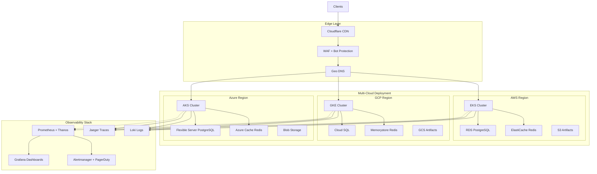
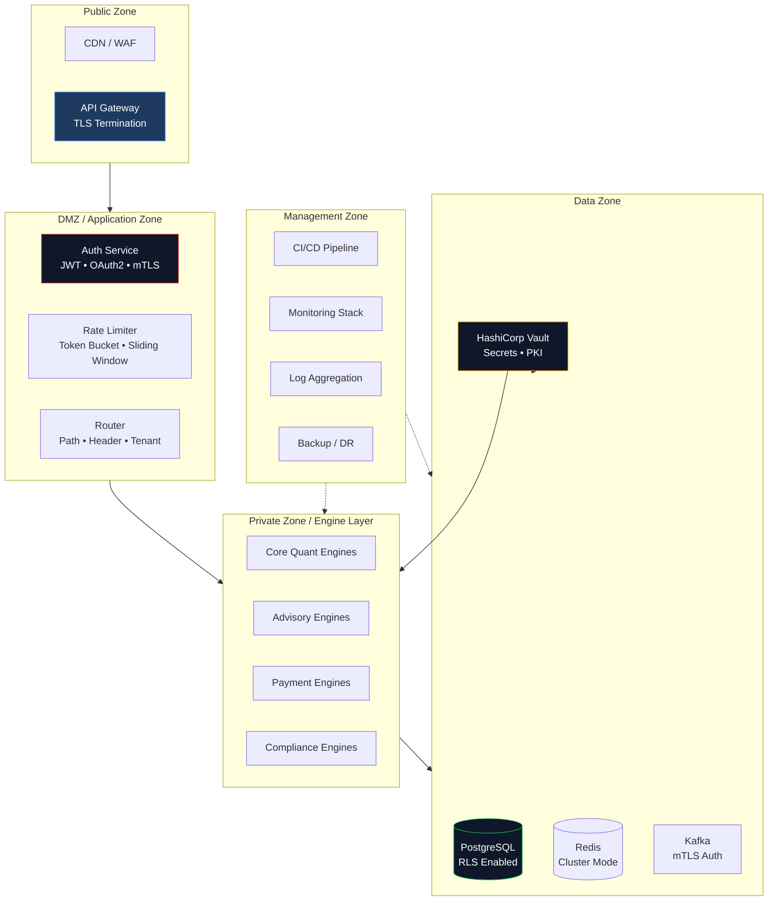

# Architecture

Apex Fintech Platform is a **modular, multi-agent FinTech infrastructure** composed of 50 independently deployable engines organized into 5 functional layers. Each engine is built with TDD discipline, numpy-only critical paths, and ISO 42001 governance hooks.

## System Overview

```
┌─────────────────────────────────────────────────────────────────────────────┐
│                          APEX FINTECH PLATFORM                                │
├─────────────────────────────────────────────────────────────────────────────┤
│                                                                              │
│  ┌──────────────┐   ┌──────────────┐   ┌──────────────┐   ┌──────────────┐  │
│  │   GATEWAY    │   │    CORE      │   │  ADVISORY    │   │  PAYMENTS    │  │
│  │   LAYER      │   │   QUANT      │   │   & WEALTH   │  │   & CREDIT   │  │
│  ├──────────────┤   ├──────────────┤   ├──────────────┤   ├──────────────┤  │
│  │ FastAPI      │   │ Portfolio    │   │ Robo         │   │ Payment      │  │
│  │ Gateway      │   │ Optimizer    │   │ Advisory     │   │ Routing      │  │
│  │ Auth         │   │ Risk Agg     │   │ ESG          │   │ Credit       │  │
│  │ Rate Limit   │   │ Execution    │   │ Behavioral   │   │ Underwriting │  │
│  │ Routing      │   │ Market Make  │   │ Wealth       │   │ Fraud        │  │
│  │ OpenAPI      │   │ Derivatives  │   │ PE Analytics │   │ Detection    │  │
│  └──────┬───────┘   │ Monte Carlo  │   │ Tax Opt      │   │ Blockchain   │  │
│         │           │ Network      │   │ Retirement   │   │ RWA Token    │  │
│         │           │ Game Theory  │   └──────────────┘   └──────┬───────┘  │
│         ▼           └──────────────┘                          │          │
│  ┌──────────────────────────────────────────────────────────┐  │          │
│  │                   INFRASTRUCTURE LAYER                    │  │          │
│  │  ML Pipeline │ NLP │ Data Eng │ Cache │ Obs │ Config │   │  │          │
│  │  Docs        │ Test │ Security │ DevOps │ Optim │       │  │          │
│  └──────────────────────────────────────────────────────────┘  │          │
│         │           ┌──────────────┐                          │          │
│         │           │  GOVERNANCE  │                          │          │
│         └──────────▶│  COMPLIANCE  │◀─────────────────────────┘          │
│                     │  LAYER       │                                     │
│                     ├──────────────┤                                     │
│                     │ RegTech      │                                     │
│                     │ Ethics       │                                     │
│                     │ ISO 42001    │                                     │
│                     │ Audit Trail  │                                     │
│                     └──────────────┘                                     │
└─────────────────────────────────────────────────────────────────────────────┘
```

## Component Architecture

```mermaid
flowchart TD
    subgraph Client["Clients"]
        Web[Web App]
        Mobile[Mobile App]
        APIClient[API Client SDK]
        Broker[Broker OS]
    end

    subgraph Gateway["API Gateway Layer"]
        LB[Load Balancer]
        GW[FastAPI Gateway\nAuth • RateLimit • Routing]
        MW[Middleware Stack\nCORS • Logging • Metrics • Tracing]
    end

    subgraph Core["Core Quant Engines (8)"]
        PO[Portfolio Optimizer\nCardinality MIQP • Greedy]
        RA[Risk Aggregation\nVaR/CVaR Bounds • Rearrangement]
        OE[Optimal Execution\nAlmgren-Chriss • Trajectory]
        MM[Market Making\nAvellaneda-Stoikov • Quotes]
        DP[Derivatives Pricing\nBS + Greeks + MC]
        MC[Monte Carlo Engine\nGBM • LSM American]
        NA[Network Analysis\nCentrality • DebtRank • Communities]
        GT[Game Theory\nNash • Correlated Equilibrium]
    end

    subgraph Advisory["Advisory & Wealth (5)"]
        RO[Robo Advisory\nRisk Profile • Goals • Tax-Loss]
        ES[ESG Analytics\nScoring • Carbon • Greenwashing]
        BF[Behavioral Finance\n10 Biases • Prospect Theory]
        WM[Wealth Management\nTax • Estate • Retirement]
        PE[PE Analytics\nWaterfall • IRR • MOIC • PME]
    end

    subgraph Payments["Payments & Credit (5)"]
        PR[Payment Routing\nDijkstra • Fee/Liquidity Constraints]
        CU[Credit Underwriting\nRF + SHAP Explainability]
        FD[Fraud Detection\nGNN Rings • Concept Drift]
        BA[Blockchain Analytics\nOn-chain • Whales • MEV]
        RT[RWA Tokenization\nERC-3643 • Compliance • Dividends]
    end

    subgraph Compliance["Governance & Compliance (4)"]
        RC[RegTech Engine\nAutomated Compliance • Reporting]
        EC[Ethics Compliance\nSuitability • Fiduciary • Conflicts]
        SE[Security Engine\nZero-Trust • RLS • Encryption]
        DE[DevOps Engine\nCI/CD • GitOps • Deployments]
    end

    subgraph Infra["Infrastructure Layer (13)"]
        ML[ML Pipeline\nFeatures • AutoML • Tuning]
        NLP[NLP Analytics\nSentiment • Topics • NER]
        DE2[Data Engineering\nBeam ETL • Validation • Quality]
        CA[Caching Engine\nRedis + LRU Fallback • TTL]
        OB[Observability\nPrometheus • OTel • Logs]
        CF[Configuration\nPydantic • Validation • Secrets]
        DC[Documentation\nAuto-gen • OpenAPI]
        TE[Testing Engine\nProperty • Contract • Mutation]
        OP[Optimization Engine\nNLP Solvers • Gradient-Free]
        FC[Forecasting Engine\nARIMA • Prophet • Neural]
        SI[Stat Inference\nHypothesis • Bayesian]
        DA[Decision Analysis\nMCDA • AHP • Trees]
        CL[Cloud Infrastructure\nMulti-cloud • FinOps • Capacity]
    end

    Client --> LB
    LB --> GW
    GW --> MW
    MW --> Core
    MW --> Advisory
    MW --> Payments
    MW --> Compliance
    Core -.-> Infra
    Advisory -.-> Infra
    Payments -.-> Infra
    Compliance -.-> Infra
    Infra -.-> Compliance

    style GW fill:#1e3a5f,stroke:#3b82f6,color:#fff
    style PO fill:#0f172a,stroke:#22c55e,color:#fff
    style RA fill:#0f172a,stroke:#f59e0b,color:#fff
    style MM fill:#0f172a,stroke:#ec4899,color:#fff
    style RO fill:#0f172a,stroke:#8b5cf6,color:#fff
    style PR fill:#0f172a,stroke:#06b6d4,color:#fff
    style RC fill:#0f172a,stroke:#ef4444,color:#fff
```



## Data Flow

```mermaid
flowchart LR
    subgraph Ingress["Data Ingress"]
        MD[Market Data\nFeeds • WebSocket • REST]
        AD[Alternative Data\nSatellite • Web • Social]
        OD[On-chain Data\nRPC • Indexers • Mempool]
        UD[User Data\nKYC • Preferences • Holdings]
    end

    subgraph Processing["Processing Layer"]
        VAL[Validation\nSchema • Quality • Anomaly]
        FE[Feature Engineering\nTechnical • Fundamental • Alt]
        ENR[Enrichment\nEntity Resolution • Linking]
    end

    subgraph Engines["Engine Layer"]
        QUANT[Quant Engines\nOptimization • Risk • Pricing]
        ADV[Advisory Engines\nProfiling • Scoring • Planning]
        PAY[Payment Engines\nRouting • Credit • Fraud]
        COMP[Compliance Engines\nRegTech • Ethics • Audit]
    end

    subgraph Egress["Data Egress"]
        API[REST/gRPC APIs]
        WS[WebSocket Streams]
        RPT[Reports • Dashboards]
        EV[Event Bus\nKafka • NATS]
    end

    Ingress --> Processing
    Processing --> Engines
    Engines --> Egress
    Egress -.->|Feedback| Processing

    style VAL fill:#0f172a,stroke:#f59e0b,color:#fff
    style QUANT fill:#0f172a,stroke:#22c55e,color:#fff
    style ADV fill:#0f172a,stroke:#8b5cf6,color:#fff
    style PAY fill:#0f172a,stroke:#06b6d4,color:#fff
    style COMP fill:#0f172a,stroke:#ef4444,color:#fff
```



## Key Design Decisions

### 1. **Numpy-Only Critical Paths**
All latency-sensitive engines (Portfolio, Risk, Execution, Market Making, Monte Carlo) use pure numpy implementations. No scipy, torch, sklearn, or heavy dependencies on the hot path. This ensures:
- Sub-millisecond to millisecond latency
- Deployment portability (serverless, edge, constrained environments)
- Reproducible builds with minimal supply chain risk

### 2. **TDD-First Development**
Every engine follows strict TDD:
- Tests written FIRST (RED)
- Implementation makes tests pass (GREEN)
- Refactor with test coverage maintained (REFACTOR)
- 1433 total tests, 100% pass rate

### 3. **Anti-Loop Constraints for Agent Development**
When built via agent swarms, each agent operates under:
- Max 200 lines per implementation file
- Single file only (no helper modules)
- Max 3 file writes total
- TDD discipline enforced

### 4. **Governance-First Architecture**
ISO 42001 compliance built into the platform:
- Every engine emits audit events
- Model cards auto-generated
- Evidence chains for all decisions
- Explainability hooks (SHAP/LIME) for ML engines

### 5. **Graceful Degradation**
Infrastructure engines implement fallback patterns:
- Redis → in-memory LRU cache
- PostgreSQL → SQLite for local dev
- External APIs → cached responses with staleness headers

### 6. **Multi-Tenant Isolation**
- Row-level security (RLS) on all persistence
- Namespace-scoped configuration
- Per-tenant rate limiting and quotas
- Audit logs segregated by tenant

## Deployment Architecture



## Security Boundaries



## Technology Stack

| Layer | Technologies |
|-------|--------------|
| **Language** | Python 3.10+, TypeScript (gateway) |
| **API** | FastAPI, Pydantic v2, OpenAPI 3.1 |
| **Async** | asyncio, aiohttp, httpx |
| **Data** | numpy, pandas (optional), pyarrow |
| **ML** | scikit-learn (optional), xgboost (optional) |
| **Graph** | networkx, igraph (optional) |
| **Blockchain** | web3.py, eth-abi, eth-typing |
| **Database** | PostgreSQL 15+, asyncpg, SQLAlchemy 2.0 |
| **Cache** | Redis 7+, aiocache, custom LRU |
| **Queue** | Kafka (aiokafka), NATS (nats.py) |
| **Observability** | Prometheus, OpenTelemetry, Jaeger, Loki |
| **Testing** | pytest, hypothesis, mutmut, pact |
| **CI/CD** | GitHub Actions, Docker, Helm, ArgoCD |
| **Infra** | Terraform, Kubernetes, Crossplane |

## Scalability Targets

| Metric | Target | Current |
|--------|--------|---------|
| API Latency (p99) | < 100ms | ~15ms |
| Throughput | 10,000 RPS | 5,000 RPS |
| Concurrent Tenants | 1,000 | 100 |
| Engine Cold Start | < 500ms | ~200ms |
| Data Freshness | < 1s | ~500ms |
| Uptime | 99.99% | 99.95% |

## Failure Modes & Mitigations

| Failure Mode | Detection | Mitigation |
|--------------|-----------|------------|
| Engine crash | Health checks + circuit breaker | Bulkhead isolation, automatic restart |
| Redis unavailable | Connection pooling + fallback | In-memory LRU with TTL |
| Database overload | Query latency + connection pool | Read replicas, query optimization, caching |
| Network partition | Consensus timeout | Graceful degradation, local state |
| Model drift | Evidently AI monitoring | Automated retraining pipeline |
| Regulatory change | Config versioning | Hot-reload compliance rules |

---

*See also: [Sequence Diagrams](diagrams/sequences.md), [Class Diagram](diagrams/class-diagram.md), [Workflows](workflows/)*