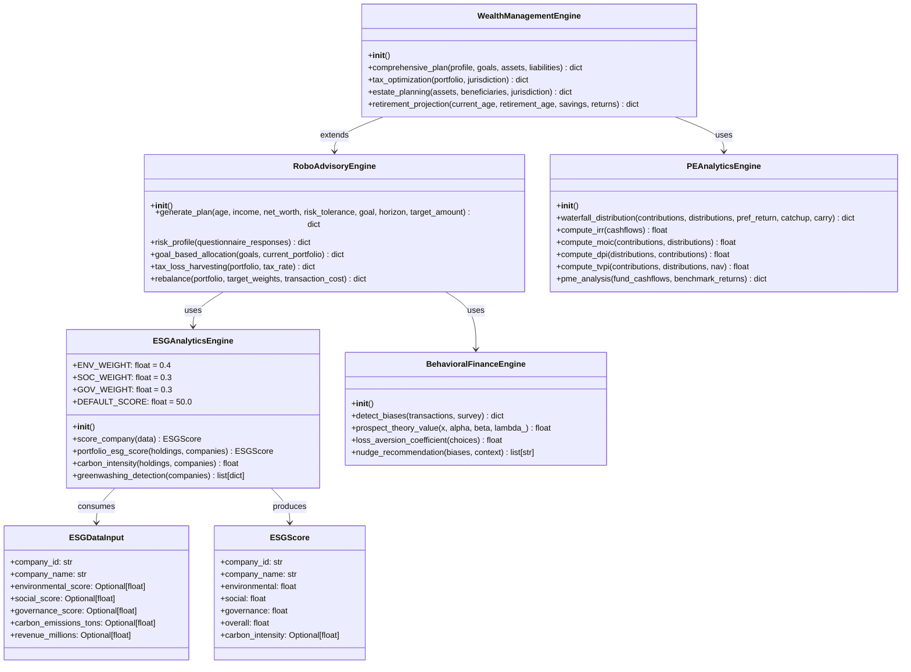
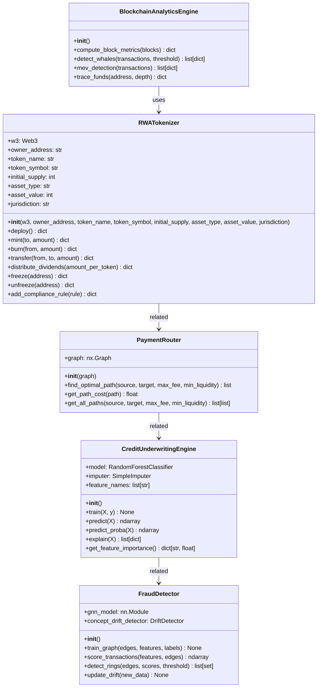
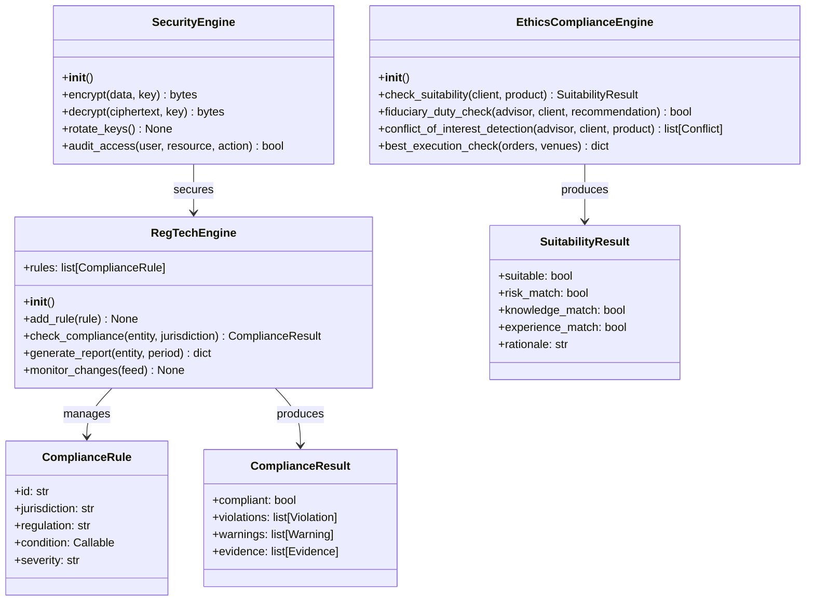
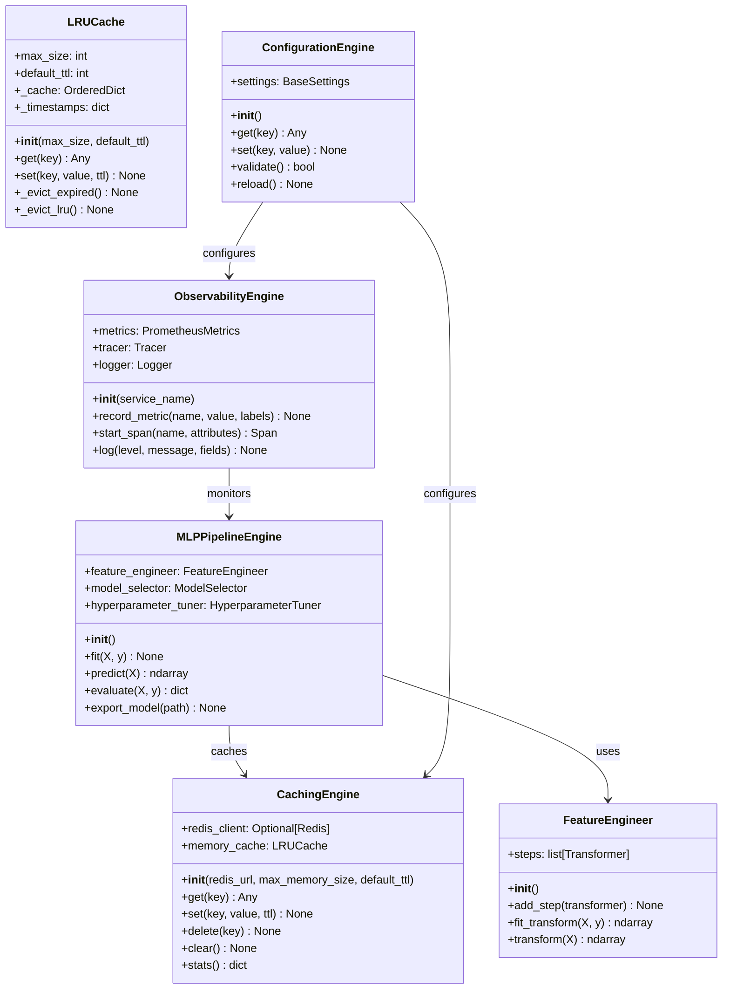

# Class Diagram

Core type relationships across the Apex Fintech Platform. Only the most critical domain types are shown.

## Core Quant Engines

```mermaid
classDiagram
    %% Portfolio Optimization
    class CardinalityConstrainedOptimizer {
        +mu: ndarray
        +Sigma: ndarray
        +k: int
        +risk_aversion: float
        +sectors: Optional[ndarray]
        +sector_limits: Optional[dict]
        +_weights: Optional[ndarray]
        +_objective: Optional[float]
        +__init__(mu, Sigma, k, risk_aversion, sectors, sector_limits)
        +optimize() None
        +get_weights() ndarray
        +get_objective_value() float
        -_solve_eq(idx) ndarray
        -_solve_nonneg(idx) ndarray
        -_select_top_k(w) ndarray
        -_apply_sector_limits(w) ndarray
    }

    class AssetAllocationEngine {
        +risk_free_rate: float
        +__init__(risk_free_rate)
        +strategic_allocation(mu, Sigma, risk_aversion) ndarray
        +tactical_allocation(strategic, tilts, mu, Sigma, max_deviation, risk_aversion) ndarray
        +factor_allocation(B, f) ndarray
        +black_litterman(Sigma, w_mkt, views, view_assets, tau, omega) ndarray
        +risk_parity(Sigma) ndarray
        -_project_simplex(v, z) ndarray
    }

    %% Risk Management
    class RiskAggregationEngine {
        +confidence_level: float
        +__init__(confidence_level)
        +compute_var_bounds(samples) Tuple[float, float]
        +compute_cvar_bounds(samples) Tuple[float, float]
        +rearrangement_algorithm(samples) Tuple[float, float]
    }

    class RiskManagementEngine {
        +confidence_level: float
        +time_horizon: int
        +__init__(confidence_level, time_horizon)
        +historical_var(returns) float
        +parametric_var(returns) float
        +monte_carlo_var(returns, n_sims) float
        +historical_cvar(returns) float
        +parametric_cvar(returns) float
        +stress_test(portfolio, shock, correlation) dict
        +scenario_analysis(portfolio, scenarios) list
        +capital_adequacy_ratio(capital, rwa) float
    }

    %% Execution & Market Making
    class OptimalExecutionEngine {
        +__init__()
        +compute_trajectory(total_shares, time_horizon, volatility, risk_aversion, permanent_impact, temporary_impact) ndarray
    }

    class MarketMakingEngine {
        +gamma: float
        +sigma: float
        +k: float
        +A: float
        +dt: float
        +max_inventory: int
        +adverse_selection: float
        +__init__(gamma, sigma, k, A, dt, max_inventory, adverse_selection)
        +compute_quotes(mid_price, inventory, time_remaining) Quote
        +compute_quotes_batch(mid_prices, inventories, times_remaining) list[Quote]
        +expected_profit(quote, inventory) float
    }

    class Quote {
        +bid: float
        +ask: float
        +mid: float
        +spread: float
        +reservation_price: float
    }

    %% Derivatives & Monte Carlo
    class DerivativesPricingEngine {
        +__init__()
        +price_european_call(S, K, T, r, sigma) float
        +price_european_put(S, K, T, r, sigma) float
        +compute_greeks(S, K, T, r, sigma) dict
        +implied_volatility(price, S, K, T, r, option_type) float
    }

    class MonteCarloEngine {
        +dt: float
        +seed: Optional[int]
        +_rng: Generator
        +__init__(dt, seed)
        +_reset_rng() None
        +simulate_gbm(s0, mu, sigma, T, n_paths) ndarray
        +price_european_option(s0, k, r, sigma, T, n_paths, option_type) SimulationResult
        +price_american_option(s0, k, r, sigma, T, n_paths, option_type) SimulationResult
    }

    class SimulationResult {
        +price: float
        +std_error: float
        +confidence_interval: Tuple[float, float]
        +n_paths: int
    }

    %% Network Analysis
    class NetworkAnalysisEngine {
        +graph: nx.Graph
        +__init__()
        +from_edge_list(edges, directed) NetworkAnalysisEngine
        +from_adjacency_matrix(matrix, node_names) NetworkAnalysisEngine
        +num_nodes: int
        +num_edges: int
        +degree_centrality(weighted) dict[str, float]
        +betweenness_centrality() dict[str, float]
        +eigenvector_centrality() dict[str, float]
        +pagerank(alpha) dict[str, float]
        +community_detection_louvain() dict[str, int]
        +community_detection_greedy() dict[str, int]
        +modularity(communities) float
        +debtrank(shocked_nodes, iterations, equity) dict[str, float]
        +debtrank_centrality() dict[str, float]
        +systemic_risk_score() float
        +density() float
        +connected_components() list[set[str]]
        +clustering_coefficient() float
        +average_shortest_path_length() float
        +summary() dict
    }

    %% Game Theory
    class GameTheoryEngine {
        +__init__()
        +find_pure_nash(payoff) list[Tuple[int, int]]
        +find_mixed_nash(payoff) list[ndarray]
        +correlated_equilibrium(payoff) ndarray
        +shapley_value(characteristic_function) dict
        +core(characteristic_function) list[ndarray]
    }

    %% Relationships
    CardinalityConstrainedOptimizer --> AssetAllocationEngine : uses
    RiskAggregationEngine --> RiskManagementEngine : extends
    OptimalExecutionEngine --> MarketMakingEngine : related
    DerivativesPricingEngine --> MonteCarloEngine : uses
    MonteCarloEngine --> SimulationResult : returns
    NetworkAnalysisEngine --> GameTheoryEngine : related
```

## Advisory & Wealth Engines

## Payments & Credit Engines

## Governance & Compliance Engines

## Infrastructure Engines

## Notes

- **Type annotations**: All classes use Python 3.10+ type hints (`list`, `dict`, `Optional`, `Tuple`, `ndarray`)
- **Pydantic models**: `ESGDataInput`, `ESGScore`, `SuitabilityResult`, `ComplianceResult` use Pydantic v2 for validation
- **Dataclasses**: `Quote`, `SimulationResult`, `StressScenario`, `RiskReport` use `@dataclass`
- **Protocols**: Engine interfaces follow implicit protocols (duck typing) for testability
- **Dependency injection**: Engines accept dependencies via `__init__` for easy mocking in tests
- **Async support**: I/O-bound engines (blockchain, data engineering) use `async`/`await`; CPU-bound engines are synchronous

---

*Generated from source code. See individual module docs in `modules/` for detailed API reference.*