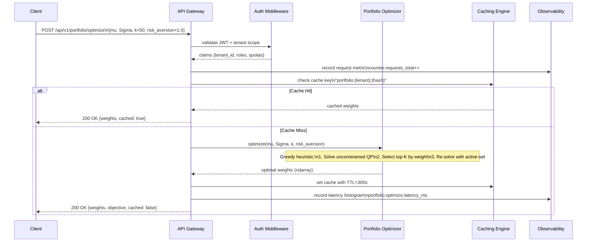
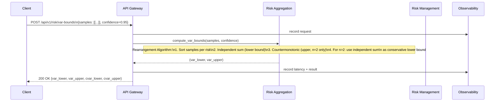
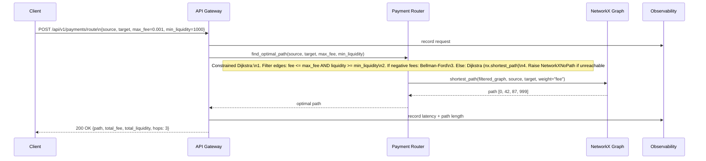
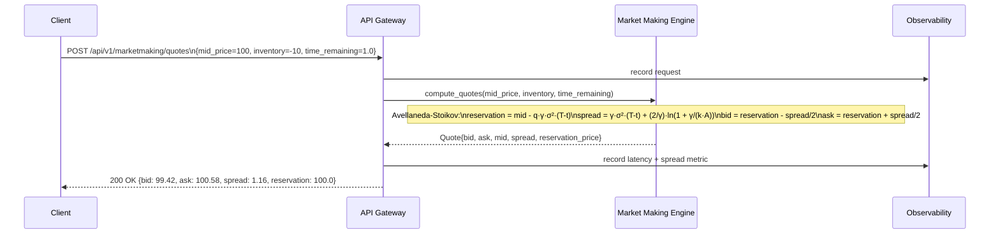
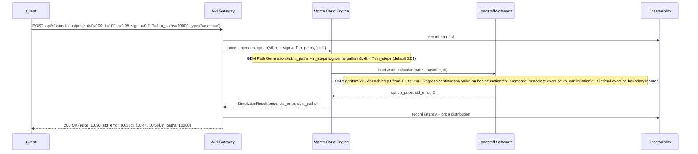
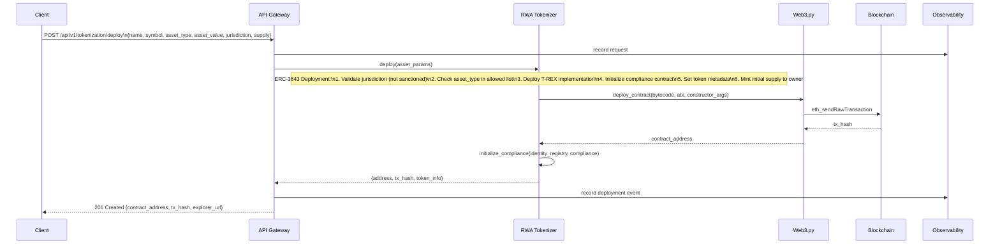
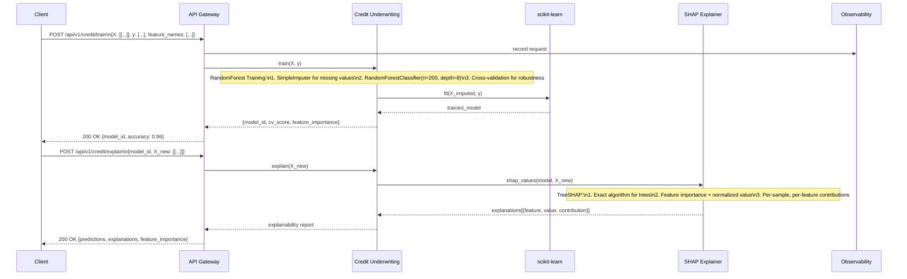
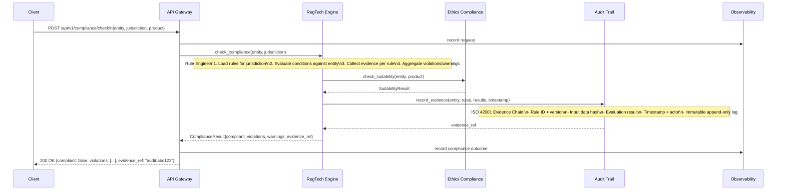
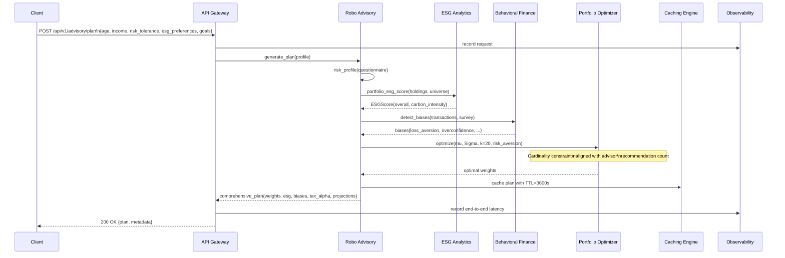

# Sequence Diagrams

Key workflows in the Apex Fintech Platform. Each diagram traces the actual call path through the codebase.

---

## Workflow 1: Portfolio Optimization Request

**Description**: Client requests cardinality-constrained portfolio optimization via the API gateway.

**Walkthrough:**
1. **Request validation** — [`src/api/gateway.py:optimize_portfolio`](src/api/gateway.py) validates input schema via Pydantic
2. **Auth** — [`src/security/engine.py:verify_token`](src/security/engine.py) checks JWT signature, expiry, tenant claims
3. **Cache check** — [`src/caching/engine.py:get`](src/caching/engine.py) tries Redis first, falls back to in-memory LRU
4. **Optimization** — [`src/portfolio/optimizer.py:optimize`](src/portfolio/optimizer.py) runs 3-step greedy heuristic
5. **Response** — Weights serialized to JSON, metadata includes cache status and objective value

---

## Workflow 2: Risk Aggregation with VaR Bounds

**Description**: Compute VaR/CVaR bounds for a portfolio using the rearrangement algorithm.

**Walkthrough:**
1. **Input validation** — Samples shape checked: `(n_risks, n_scenarios)`
2. **Rearrangement** — [`src/risk/aggregation.py:compute_var_bounds`](src/risk/aggregation.py) implements Puccetti & Rüschendorf (2012)
3. **Conservative bounds** — For n>2 risks, countermonotonic coupling is invalid; independent sum provides valid lower bound
4. **CVaR bounds** — Same rearrangement applied to tail expectations

---

## Workflow 3: Payment Routing with Constraints

**Description**: Find optimal payment path in a network with fee and liquidity constraints.

**Walkthrough:**
1. **Graph construction** — [`src/payments/routing.py:__init__`](src/payments/routing.py) builds NetworkX graph from edge list
2. **Constraint filtering** — Subgraph created with only viable edges
3. **Algorithm selection** — Dijkstra for non-negative fees, Bellman-Ford if negative fees detected
4. **Result** — Path, cumulative fee, minimum liquidity along path, hop count

---

## Workflow 4: Market Making Quote Generation

**Description**: Generate Avellaneda-Stoikov optimal bid/ask quotes for a given inventory and time horizon.

**Walkthrough:**
1. **Parameter validation** — Mid price > 0, time_remaining >= 0, inventory clamped to max_inventory
2. **Reservation price** — Shifts mid by inventory risk: `q * γ * σ² * (T-t)`
3. **Optimal spread** — Balances adverse selection vs. order arrival: `γσ²τ + (2/γ)ln(1+γ/kA)`
4. **Adverse selection** — Optional spread widening proportional to `|inventory|`

---

## Workflow 5: Monte Carlo Option Pricing (European + American)

**Description**: Price European and American options using Monte Carlo with Longstaff-Schwartz for early exercise.

**Walkthrough:**
1. **Path generation** — [`src/simulation/engine.py:simulate_gbm`](src/simulation/engine.py) uses vectorized numpy
2. **LSM regression** — Polynomial basis (1, S, S²) for continuation value estimation
3. **Early exercise** — Compares intrinsic value vs. discounted continuation at each step
4. **Statistics** — Price, standard error, 95% confidence interval from path distribution

---

## Workflow 6: RWA Token Deployment (ERC-3643)

**Description**: Deploy a compliant security token for a real-world asset.

**Walkthrough:**
1. **Compliance checks** — [`src/tokenization/rwa.py:__init__`](src/tokenization/rwa.py) validates jurisdiction against sanctions list
2. **Contract deployment** — Uses Web3.py to deploy ERC-3643 (T-REX) implementation
3. **Identity registry** — Links to on-chain identity verification (KYC/AML providers)
4. **Compliance rules** — Transfer restrictions, holding limits, freeze functions configured

---

## Workflow 7: AI Credit Underwriting with Explainability

**Description**: Train credit scoring model and generate SHAP explanations for decisions.

**Walkthrough:**
1. **Training** — [`src/credit/underwriting.py:train`](src/credit/underwriting.py) uses RF with imputation
2. **Explainability** — TreeSHAP provides exact feature contributions per prediction
3. **Output** — Prediction + per-feature SHAP values + global feature importance ranking

---

## Workflow 8: Compliance Check with Audit Trail

**Description**: Run regulatory compliance check and generate auditable evidence chain.

**Walkthrough:**
1. **Rule evaluation** — [`src/regtech/compliance.py:check_compliance`](src/regtech/compliance.py) loads jurisdiction-specific rules
2. **Ethics check** — [`src/ethics/compliance.py:check_suitability`](src/ethics/compliance.py) validates fiduciary duty
3. **Evidence chain** — Every check creates immutable audit record with input hashes
4. **Traceability** — Evidence reference allows full reconstruction of decision

---

## Workflow 9: Multi-Engine Advisory Pipeline

**Description**: End-to-end robo-advisory workflow combining risk profiling, ESG, behavioral, and portfolio optimization.

**Walkthrough:**
1. **Risk profiling** — Questionnaire maps to risk aversion parameter
2. **ESG integration** — Universe filtered/scored by ESG preferences
3. **Behavioral adjustments** — Biases detected → portfolio nudges (e.g., reduce loss-aversion-driven concentration)
4. **Optimization** — Portfolio optimizer constrained by advisor's recommended position count
5. **Tax alpha** — Tax-loss harvesting opportunities identified
6. **Caching** — Full plan cached for 1 hour for repeat requests

---

*See also: [Architecture](architecture.md), [Class Diagram](diagrams/class-diagram.md), [Workflows](workflows/)*